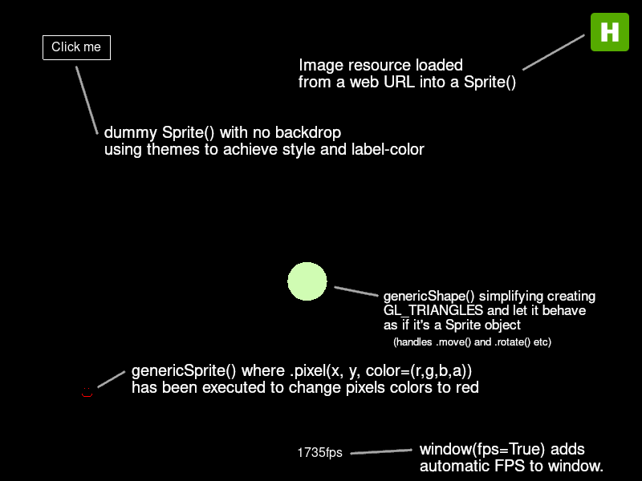

pyglet2d
=========

Create 2D/GUI by wrapping pyglet functionality as transparent as possible.<br>
Create buttons, player objects or tiled backgrounds easily. A generic 2D/GUI framework.

Documentation
=============

 * [Wiki](https://github.com/Torxed/pyglet2d/wiki)

Usage example
=============

Here's a quick demo of what you can do:<br>
*(for more examples, see [test.py](/test.py))*



```Python
from pyglet_gui import *
from random import randint

class circle(genericShape):
	def __init__(self, *args, **kwargs):
		## TODO: Add batch
		super(circle, self).__init__('GL_TRIANGLES', *args, **kwargs)

	def update(self):
		self.move(randint(-1, 1), randint(-1, 1))

class window(windowWrapper):
	def __init__(self):
		super(window, self).__init__(vsync=True, fps=True)

		self.add_sprite('circle', circle(x=int(self.width/2), y=int(self.height/2), alpha=0))
		self.add_sprite('webimage', resources.image_from_url('https://hvornum.se/favicon.ico', x=self.width-64, y=self.height-64))

W = window()
W.run()
```

Helper functions
================

```python
resources.image_from_url(url, x=0, y=0)
```

This will fetch, load a image from an URL.<br>
This image will be placed inside a `ImageObject` and then placed in a `genericSprite`.

```python
sprite = genericSprite(texture=None)
sprite.move(5, 0) # Move 5 pixels in the X asis to the right
sprite.rotate(90) # Rotate the sprite 90deg (0-360) from current rotation
```

The `genericSprite` is a extension of `pyglet.sprite.Sprite` which just adds additional functionality as transparently as possible. things such as rotation, movement and interaction *(click, hover, hover out etc)*.

The class takes a number of different `texture`s as well,

 * `str` will be parsed as a file location, and loaded as a image resource and then convert it to a `pyglet.sprite.Sprite()`
 * `bytes` will be parsed as `PNG` color data as-is and treated as a already existing image resource
 * `ImageObject` will assume it's a pre-loaded image resource and do nothing
 * `None` will attempt to generate a `PNG` assuming `width` and `height` is supplied to the `genericSprite`, and load the generated `PNG` as a image resource.
 * `None` and no `width`/`height` is supplied, or `_no_backdrop=True` is set. `_no_backdrop` means we want no background to be generated or rendered for this object. In this case, the sprite will use a placeholder `self._texture` to satisfy `pyglet`'s internals and not instanciate the `pyglet.sprite.Sprite()` but keep all the functionality of the sprite, such as changing batch, moving, rotating etc.

```python
genericInteractive(label="", width=120, height=20)
```

`genericInteractive` is a extension of `genericSprite` with some additional options such as `themes`.<br>
It will try to apply a general set of themes to the object, and is a simplification to create `buttons` etc.

```python
class themedObject(theme='default')
```

Inheriting this class will try to wrap whatever the parent object is, in a theme of sorts.<br>
This means adding borders, `on_hover` events and possibly backdrops or images as the background. Much like `CSS` to already existing elements in HTML.

```python
genericShape(shapeType='GL_TRIANGLES')
```

Generic shape handler, create `GL_` vertices quicker and easier for simpler things.<br>
Won't handle advanced shapes but will let you work with simpler objects (circles, triangles, squares) as if they were sprites.

Camera movement
===============

Camera movements are built-in to the window. Simply using `self.camera` will get you what you want.

```python
class window(windowWrapper):
	def __init__(self):
		super(window, self).__init__(vsync=False, fps=True)

		self.add_sprite('button', genericInteractive(label='Click me', x=64, y=self.height-64))

	def key_W(self, symbol, event, modifiers, *args, **kwargs):
		self.camera.move(0, 1)
```

This will move the camera whenever <kbd>W</kbd> is pressed.